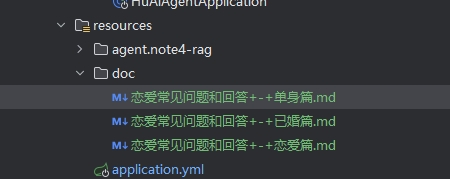
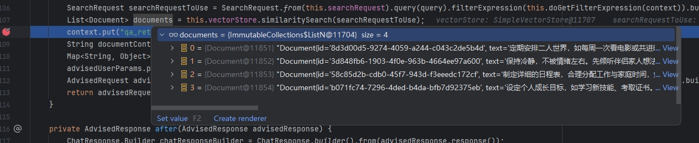
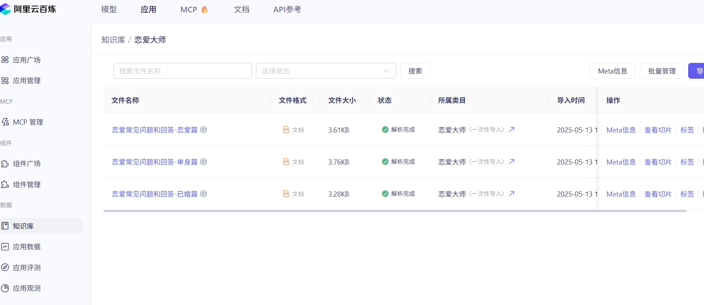
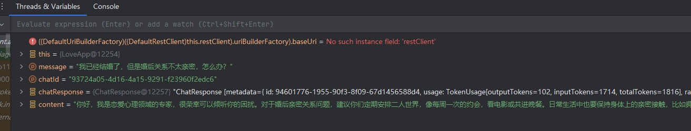

# 本节内容
1）理解 RAG 的工作流程和原理
2）实战基 于 Spring ؜AI + 本地知识库实现 RAG
3）实战基于 Spring AI + 云知识库实现 RAG

# 一、理解 RAG 的工作流程和原理

## 什么是RAG？
RAG（Retrieval-Augmented Generation，检索增强生成）是一种结合了信息检索和生成式模型的AI技术，旨在提高生成内容的准确性和相关性。

想象一下，我们有一个超级聪明的AI助手，但它有时候会“胡说八道”或者回答得不够准确。RAG就像给这个助手配了一个“超级图书馆”和一个“图书管理员”。当你问问题时，AI不仅靠自己的“记忆”回答，还会先让“图书管理员”去图书馆里快速翻找相关资料，然后根据这些资料生成更精准的回答。

简单来说，RAG就是：

**检索（Retrieval）：** 从一个知识库（比如文档、网页、数据库）中找到和问题相关的资料。

**生成（Generation）：** 用大语言模型（比如像我这样的模型）根据检索到的资料生成自然、准确的回答。

## 为什么需要RAG？

普通的大语言模型（LLM）虽然很强大，但有几个问题：

**知识局限：** 模型的知识是训练时固定的，可能过时或不完整（比如我虽然很新，但也不可能知道一切）。

**幻觉（Hallucination）：** 有时候模型会“编”出看似合理但实际上错误的信息。

**缺乏针对性：** 对于专业领域或特定场景，模型可能无法提供足够精确的答案。

RAG通过引入外部知识库来解决这些问题。它让模型在回答时能“查资料”，就像学生考试时可以翻书一样，既减少错误，又能提供更专业的回答。

## RAG 工作原理（简单流程）

RAG的运行可以分为以下几个步骤：

1. 用户提问：你问了一个问题，比如“2025年最新的量子计算进展是什么？”。
2. 检索阶段：
   - RAG会把你的问题转化成一个“查询”（query），然后去一个外部知识库（比如一堆最新的论文、新闻或数据库）中搜索相关信息。
   - 通常使用一种叫“向量搜索”的技术，把问题和知识库中的内容都变成数字表示（向量），然后找到最相似的文档。
3. 生成阶段：
   - 检索到的相关文档被送给语言模型。 
   - 模型结合这些文档内容，生成一个更准确、更具体的回答，而不是只靠自己的“记忆”。
4. 输出答案：你得到一个基于最新资料的回答，而不是模型凭空“猜”的结果。


# 二、实战基 于 Spring ؜AI + 本地知识库实现 RAG

由于是第一个RAG 程序，我们参؜考标准的 RAG 开发步骤并进行一定的简化，来实现基于本地知识库的 AI 恋爱知识问答应用。

标准的 RAG 开发步骤：

1. 文档收集和切割
2. 向量转换和存储
3. 切片过滤和检索
4. 查询增强和关联

简化后的 RAG 开发步骤：

1. 文档准备
2. 文档读取
3. 向量转换和存储
4. 查询增强

## 1.文档准备


## 2.文档读取

使用 MarkdownDocumentReader 来读取 Markdown 文档。
在根目录下新建 rag 包，编写文档加载器类 LoveAppDocumentLoader
```java

@Component
@Slf4j
public class LoveAppDocumentLoader {

    private final ResourcePatternResolver resourcePatternResolver;

    LoveAppDocumentLoader(ResourcePatternResolver resourcePatternResolver) {
        this.resourcePatternResolver = resourcePatternResolver;
    }

    public List<Document> loadMarkdowns() {
        List<Document> allDocuments = new ArrayList<>();
        try {
            // 这里可以修改为你要加载的多个 Markdown 文件的路径模式
            Resource[] resources = resourcePatternResolver.getResources("classpath:doc/*.md");
            for (Resource resource : resources) {
                String fileName = resource.getFilename();
                MarkdownDocumentReaderConfig config = MarkdownDocumentReaderConfig.builder()
                        .withHorizontalRuleCreateDocument(true)
                        .withIncludeCodeBlock(false)
                        .withIncludeBlockquote(false)
                        .withAdditionalMetadata("filename", fileName)
                        .build();
                MarkdownDocumentReader reader = new MarkdownDocumentReader(resource, config);
                allDocuments.addAll(reader.get());
            }
        } catch (IOException e) {
            log.error("Markdown 文档加载失败", e);
        }
        return allDocuments;
    }

}
```

## 3. 向量转换和存储

使用 Spri؜ng AI 内置的、基于内存读写的向量数据库 SimpleVectorStore 来保存文档
```java
@Configuration
public class LoveAppVectorStoreConfig {

    @Resource
    private LoveAppDocumentLoader loveAppDocumentLoader;

    @Bean
    VectorStore loveAppVectorStore(EmbeddingModel dashscopeEmbeddingModel) {
        SimpleVectorStore simpleVectorStore = SimpleVectorStore.builder(dashscopeEmbeddingModel)
                .build();
        // 加载文档
        List<Document> documents = loveAppDocumentLoader.loadMarkdowns();
        simpleVectorStore.add(documents);
        return simpleVectorStore;
    }
}
```

## 4. 查询增强

Spring AI 通过 Advisor 特性提供了开箱即用的 RAG 功能。主要 QuestionAnswerAdvisor问答拦截器和 RetrievalAugmentationAdvisor 检索增强拦截器.

在LoveApp中新增代码
```java
@Resource
    private VectorStore vectorStore;

    public String doChatWithRag(String message, String chatId){
        ChatResponse chatResponse = chatClient.prompt()
                .user(message)
                .advisors(spec -> spec.param(CHAT_MEMORY_CONVERSATION_ID_KEY, chatId)
                        .param(CHAT_MEMORY_RETRIEVE_SIZE_KEY, 10))
                .advisors(new MyLoggerAdvisor())
                .advisors(new QuestionAnswerAdvisor(vectorStore))
                .call()
                .chatResponse();
        String text = chatResponse.getResult().getOutput().getText();
        //log.info("content:{}",text);
        return text;
    }
```

## 5. 测试

```java
@Test
 void doChatWithRag() {
     String chatId = UUID.randomUUID().toString();
     String message = "我已经结婚了，但是婚后关系不太亲密，怎么办？";
     String answer =  loveApp.doChatWithRag(message, chatId);
     Assertions.assertNotNull(answer);
 }
```



debug和结果来看请求和回答已经基于知识库的内容。

# 三、实战基于 Spring AI + 云知识库实现 RAG

## 1. 准备数据

使用阿里云百炼平台上传文档


## 2. RAG开发

Spring AI Alibaba提供文档检索的方法，可以简化调用流程。

使用 Spring AI 提供的另一个 RAG Advisor —— RetrievalAugmentationAdvisor 检索增强顾问，可以绑定文档检索器、查询转换器和查询增强器，更灵活地构造查询。

```java
@Configuration
@Slf4j
class LoveAppRagCloudAdvisorConfig {

    @Value("${spring.ai.dashscope.api-key}")
    private String dashScopeApiKey;

    @Bean
    public Advisor loveAppRagCloudAdvisor() {
        DashScopeApi dashScopeApi = new DashScopeApi(dashScopeApiKey);
        final String KNOWLEDGE_INDEX = "恋爱大师";
        DocumentRetriever documentRetriever = new DashScopeDocumentRetriever(dashScopeApi,
                DashScopeDocumentRetrieverOptions.builder()
                        .withIndexName(KNOWLEDGE_INDEX)
                        .build());
        return RetrievalAugmentationAdvisor.builder()
                .documentRetriever(documentRetriever)
                .build();
    }
}
```

在LoveApp增加
```java
@Resource
    private Advisor loveAppRagCloudAdvisor;

    public String doChatWithRag(String message, String chatId) {
        ChatResponse chatResponse = chatClient
                .prompt()
                .user(message)
                .advisors(spec -> spec.param(CHAT_MEMORY_CONVERSATION_ID_KEY, chatId)
                        .param(CHAT_MEMORY_RETRIEVE_SIZE_KEY, 10))
                // 开启日志，便于观察效果
                .advisors(new MyLoggerAdvisor())
                // 应用增强检索服务（云知识库服务）
                .advisors(loveAppRagCloudAdvisor)
                .call()
                .chatResponse();
        String content = chatResponse.getResult().getOutput().getText();
        //log.info("content: {}", content);
        return content;
    }
```

## 3.执行测试方法
