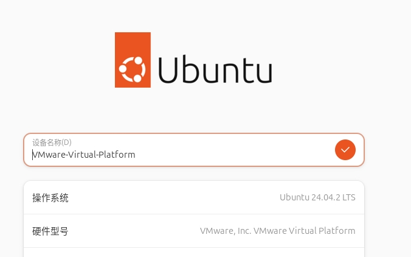

# 本节内容

1）自行整理笔记，学会通过结构؜化的方式，通过 RAG 的 4 个核心步骤来整理 RAG 的最佳实践和优化技巧。
2）编写代码，给文档添加元信息，并且؜基于 RetrievalAugmentationAdvisor 查询增强顾问，实现基于元信息的过滤。
3）利用云平台给知识库内的文؜档添加标签或元信息，重点实践自动抽取元信息的配置。

# RAG的核心特性

在笔记4中，有写到RAG的简单工作原理，让我们理解大致流程，其标准的工作流程是：

- 文档收集和切割
- 向量转换和存储
- 文档过滤和检索
- 查询增强和关联


让我们按照流程依次进行学习。

## 文档收集和切割 - ETL

ETL（Extract, Transform, Load）是指从各种数据源中提取文档、对其进行处理（切割、清洗等），并加载到知识库的过程。

### ELT


结合教程和springg AI官方文档看Spring AI 提供的 ETL 框架，它是 RAG 应用中数据处理的核心，负责从原始数据源提取数据、进行转换处理，并加载到向量数据库以支持高效检索。

**ETL 框架的核心组件:**

ETL 框架由以下三个主要接口和实现组成：
- DocumentReader（文档读取器）
- DocumentTransformer（文档转换器）
- DocumentWriter（文档写入器）

流程如图：


简单实现：通过链式调用三个组件构建 ETL 管道。例如：
```java
vectorStore.write(tokenTextSplitter.split(pdfReader.read()));
```
代码从 PDF 读取文档（pdfReader.read()），分割为小块（tokenTextSplitter.split()），然后存储到向量数据库（vectorStore.write()）。

### DocumentReader（文档读取器）
Spring AI 通过 D؜ocumentReader 组件实现文档抽取，也就是把文档加载到内存中。
D؜ocumentReader实现了Supplier<List<Document>>接口，主要负责从各种数据源中读取数据并转换乘Document对象集合。
```java
public interface DocumentReader extends Supplier<List<Document>> {
    default List<Document> read() {
        return get();
    }
}
```
实际开发中可以先去官网看看有没有自己能用的，如果没有在自己实现：


### DocumentTransformer（文档转换器）

Spring AI 通过 D؜ocumentTransformer 组件实现文档转换。

DocumentTransformer 接口实现了 Function<List<Document>, List<Document>> 接口，负责将一组文档转换为另一组文档

文档转换是保证 RAG 效果的核心步骤，也就是如何将大؜文档合理拆分为便于检索的知识碎片，Spring AI 提供了多种 DocumentTransformer 实现类，可以简单分为 3 类。

1. TextSplitter 文本分割器：提供分割单词的流程方法
2. Metada؜taEnricher 元数据增强器：元数据增强器的作用是为文档补؜充更多的元信息，便于后续检索，而不是改变文档本身的切分规则。
3. Conten؜tFormatte⁢r 内容格式化工具

### DocumentWriter（文档写入器）

Spring AI 通过 D؜ocumentWriter 组件实现文档加载（写入）。

DocumentWriter 接口实现了 Consumer<List<Document>> 接口，负责将处理后的文档写入到目标存储中：

```java
public interface DocumentWriter extends Consumer<List<Document>> {
    default void write(List<Document> documents) {
        this.accept(documents);
    }
}
```

Spring AI 提供了 ؜2 种内置的 DocumentWriter 实现：FileDocumentWriter和VectorStoreWriter

## 向量转换和存储

上一节通过文档的抽取和切割我们得到合适得文档集合，接下来我们需要把文档转为向量（嵌入）存储起来，以便后续进行高效的相似性搜索。

Spring Ai通过VectorStore接口用于与向量数据库交互操作。
```java
public interface VectorStore extends DocumentWriter {
    default String getName() {
        return this.getClass().getSimpleName();
    }

    void add(List<Document> documents);

    default void accept(List<Document> documents) {
        this.add(documents);
    }

    void delete(List<String> idList);

    void delete(Filter.Expression filterExpression);

    default void delete(String filterExpression) {
        SearchRequest searchRequest = SearchRequest.builder().filterExpression(filterExpression).build();
        Filter.Expression textExpression = searchRequest.getFilterExpression();
        Assert.notNull(textExpression, "Filter expression must not be null");
        this.delete(textExpression);
    }

    @Nullable
    List<Document> similaritySearch(SearchRequest request);

    @Nullable
    default List<Document> similaritySearch(String query) {
        return this.similaritySearch(SearchRequest.builder().query(query).build());
    }

    default <T> Optional<T> getNativeClient() {
        return Optional.empty();
    }

    public interface Builder<T extends Builder<T>> {
        T observationRegistry(ObservationRegistry observationRegistry);

        T customObservationConvention(VectorStoreObservationConvention convention);

        T batchingStrategy(BatchingStrategy batchingStrategy);

        VectorStore build();
    }
}
```
该接口主要功能是增加删除查询。

### 向量存储的工作原理
向量存储是一种专门设计用于处理高维向量数据的存储系统。这些向量通常是数据的嵌入（Embedding），通过机器学习模型（如Word2Vec、BERT、或图像模型）将文本、图像等原始数据转换为固定维度的数值向量。这些向量捕捉了数据的语义或特征，便于进行相似性搜索或比较。

向量存储的核心功能是将高维向量高效存储，并支持快速的查询和相似性搜索。其工作原理可以分为以下几个步骤：

(1) 数据向量化： 原始数据（如文本、图像、音频）通过嵌入模型转换为高维向量。
(2) 向量存储：将这些向量及其元数据（例如，原始文本、ID、标签等）存储在数据库中。为了加速查询，向量存储通常会构建索引结构。例如：近似最近邻（ANN）索引和KD树或球树
(3) 查询与检索：当用户输入查询（如一句文本），系统首先将其转换为向量表示。向量存储通过距离度量（如欧几里得距离、余弦相似度、点积）计算查询向量与存储向量之间的相似性。

### 基于PGVector实现向量存储

PGVector 是经典数据库 P؜ostgreSQL 的扩展，为 PostgreSQL 提供了存储和检索高维向量数据的能力。

两种方式：1.使用现成云数据库，网上找找。2.自己本地搭建一个

这里我选择本地搭建一个： 

1）准备虚拟机

使用vmware虚拟机创建一个ubuntu24.04系统


2）安装 postgresql-15

```shell
# 更新软件包列表：
sudo apt update

# 导入 PostgreSQL 软件源的 GPG 密钥
sudo sh -c 'echo "deb http://apt.postgresql.org/pub/repos/apt $(lsb_release -cs)-pgdg main" > /etc/apt/sources.list.d/pgdg.list'
wget --quiet -O - https://www.postgresql.org/media/keys/ACCC4CF8.asc | sudo apt-key add -

# 再次更新软件包列表
sudo apt update

# 安装 PostgreSQL 15
sudo apt install postgresql-15
```

验证安装

```shell
sudo systemctl status postgresql
# 或者，查看版本：
psql --version
```

3）设置密码

默认情况下，PostgreSQL 创建一个名为 postgres 的用户。你可以用以下命令切换到该用户并进入 PostgreSQL 命令行：
```shell
sudo -u postgres psql
# 设置 postgres 用户密码
\password xxxxx
```

4）远程访问配置

编辑以下文件：
```shell
sudo nano /etc/postgresql/15/main/postgresql.conf

# 取消注释并修改 listen_addresses = 'localhost' 为 listen_addresses = '*'.
```

配置客户端认证：
```shell
sudo nano /etc/postgresql/15/main/pg_hba.conf
# 添加一行，例如：
host all all 0.0.0.0/0 md5
```
重启服务：
```shell
sudo systemctl restart postgresql
```

5）增加向量插件

PostgreSQL 15 安装 pgvector 插件（扩展），需要确保 PostgreSQL 15 已正确安装

1 安装依赖项
```shell
sudo apt update
sudo apt install -y build-essential postgresql-server-dev-15 git
```

2 下载并编译pgvector
```shell
# 克隆 pgvector 仓库
cd /tmp
git clone --branch v0.7.4 https://gitee.com/DBres4Power/pgvector.git
# 国内gitee速度快
# git clone --branch v0.8.0 https://github.com/pgvector/pgvector.git
cd pgvector

# 编译并安装
sudo make install
```

3 启用扩展

```shell
# 连接到 PostgreSQL：
sudo -u postgres psql

# 在需要使用 pgvector 的数据库中启用扩展
CREATE EXTENSION IF NOT EXISTS vector;

# 验证扩展是否启用
\dx
```
输出应包含 vector，例如：

List of installed extensions
Name   | Version |   Schema   |         Description
--------+---------+------------+-----------------------------
vector | 0.8.0   | public     | vector data type and ivfflat/hnsw access methods

4 测试 pgvector 功能

创建一个表并测试 vector 数据类型
```shell
-- 创建带 vector 列的表
CREATE TABLE items (id SERIAL PRIMARY KEY, embedding vector(3));

-- 插入向量数据
INSERT INTO items (embedding) VALUES ('[1,2,3]'), ('[4,5,6]');

-- 查询按 L2 距离排序的最近邻
SELECT * FROM items ORDER BY embedding <-> '[3,1,2]' LIMIT 5;
```

6）数据库连接


### 项目中引入PostgreSQL

修改libs.versions.toml
```shell
pgvector = "1.0.0-M6"
spring-ai-vectore-pgvectore = {module = "org.springframework.ai:spring-ai-pgvector-store", version.ref="pgvector"}
postgressql = {module = "org.postgresql:postgresql"}
spring-boot-starter-jdbc = { module = "org.springframework.boot:spring-boot-starter-jdbc" }
```

修改build.gradle

```java
    //向量数据库
    implementation libs.spring.boot.starter.jdbc
    implementation libs.spring.ai.vectore.pgvectore
    implementation libs.postgressql
```

修改application.yml
```yaml
spring:
  ai:
    vectorstore:
      pgvector:
        index-type: HNSW
        dimensions: 1536
        distance-type: COSINE_DISTANCE
        max-document-batch-size: 10000 # Optional: Maximum number of documents per batch
  datasource:
    url: jdbc:postgresql://192.168.234.129/hu_ai_agent
    username: postgres
    password: 113023
```

创建配置类PgVectorVectorStoreConfig
```java
@Configuration
public class PgVectorVectorStoreConfig {

    @Bean
    public VectorStore pgVectorVectorStore(JdbcTemplate jdbcTemplate, EmbeddingModel dashscopeEmbeddingModel) {
        VectorStore vectorStore = PgVectorStore.builder(jdbcTemplate, dashscopeEmbeddingModel)
                .dimensions(1536)                    // Optional: defaults to model dimensions or 1536
                .distanceType(COSINE_DISTANCE)       // Optional: defaults to COSINE_DISTANCE
                .indexType(HNSW)                     // Optional: defaults to HNSW
                .initializeSchema(true)              // Optional: defaults to false
                .schemaName("public")                // Optional: defaults to "public"
                .vectorTableName("vector_store")     // Optional: defaults to "vector_store"
                .maxDocumentBatchSize(10000)         // Optional: defaults to 10000
                .build();
        return vectorStore;
    }
}

```

启动类上排查自动配置

```java
@SpringBootApplication(exclude = PgVectorStoreAutoConfiguration.class)
public class HuAiAgentApplication {

    public static void main(String[] args) {
        SpringApplication.run(HuAiAgentApplication.class, args);
    }

}
```

创建测试类PgVectorStoreConfigTest.java
```java
@SpringBootTest
public class PgVectorStoreConfigTest {

    @Resource
    VectorStore pgVectorVectorStore;

    @Test
    void test(){
        List<Document> documents = List.of(
                new Document("Spring AI rocks!! Spring AI rocks!! Spring AI rocks!! Spring AI rocks!! Spring AI rocks!!", Map.of("meta1", "meta1")),
                new Document("The World is Big and Salvation Lurks Around the Corner"),
                new Document("You walk forward facing the past and you turn back toward the future.", Map.of("meta2", "meta2")));
        // 添加文档
        pgVectorVectorStore.add(documents);
        // 相似度查询
        List<Document> results = pgVectorVectorStore.similaritySearch(SearchRequest.builder().query("Spring").topK(5).build());
        Assertions.assertNotNull(results);
    }

}

```

执行测试类，并查看数据库


## 文档过滤和检索
Spring AI 的模块化 RAG（Retrieval-Augmented Generation）架构通过将文档过滤和检索过程拆分为预检索、检索和检索后三个阶段，并为每个阶段提供可自定义的组件，显著提升了大模型生成回复的准确性和效率。

1. 预检索阶段：接收用户原始查询，通过查询转换（如改写、规范化）或查询扩展（如添加同义词、语义扩展）生成更精确的查询。
例子：用户在医疗领域的知识库查询“如何治疗感冒”。原始查询可能过于宽泛，导致检索结果包含大量无关信息。
处理：系统通过查询扩展，自动将查询改写为“治疗感冒的方法、药物、家庭护理”，并添加相关术语如“流感”“病毒性感冒”。

2. 检索阶段：使用增强的查询从多个知识库（如内部文档、外部数据库、互联网）中检索相关文档，并合并结果。
例子：用户查询“最新的人工智能伦理法规”。知识库包括公司内部政策文档、学术论文和公开的法规数据库。
处理：系统同时从多个来源检索，使用增强查询（如包含“AI伦理”“法规更新”等关键词）搜索，合并结果并初步过滤无关内容。

3. 检索后阶段：对检索到的文档进行排序、选择最相关子集，并压缩内容以减少冗余，输出精炼的文档集供大模型使用。
例子：检索阶段返回了20篇关于“人工智能伦理”的文档，但其中部分内容冗长或重复，且有些段落与查询无关。
处理：系统通过排序算法（如基于语义相关性的BM25或神经网络模型）筛选出5篇最相关的文档，并使用内容压缩技术（如提取关键段落或总结）精简文档内容。

### 预检索：优化用户查询

RewriteQueryTransformer：使用大语言模型对用户的原始查询进行改写
TranslationQueryTransformer： 将查询翻译成嵌入模型支持的目标语言。
CompressionQueryTransformer： 使用大语言模型将对话历史和后续查询压缩成一个独立的查询，类似于概括总结。
MultiQueryExpander： 使用大语言模型将一个查询扩展为多个语义上不同的变体，有助于检索额外的上下文信息并增加找到相关结果的机会。

### 检索：提高查询得相关性
之前我们有了解过 DocumentRetriever 的概念，这是 Spring AI 提供的文档检索器。每种不同的存储方案都可能有自己的文档检索器实现类，比如 VectorStoreDocumentRetriever，从向量存储中检索与输入查询语义相似的文档。它支持基于元数据的过滤、设置相似度阈值、设置返回的结果数。
```java
DocumentRetriever retriever = VectorStoreDocumentRetriever.builder()
    .vectorStore(vectorStore)
    .similarityThreshold(0.7)
    .topK(5)
    .filterExpression(new FilterExpressionBuilder()
        .eq("type", "web")
        .build())
    .build();
List<Document> documents = retriever.retrieve(new Query("谁在那里"));
```
上述代码中的 filterExpression 可以灵活地指定过滤条件。当然也可以通过构造 Query 对象的 FILTER_EXPRESSION 参数动态指定过滤表达式：
```java
Query query = Query.builder()
.text("谁在那里？")
.context(Map.of(VectorStoreDocumentRetriever.FILTER_EXPRESSION, "type == 'boy'"))
.build();
List<Document> retrievedDocuments = documentRetriever.retrieve(query);
```
文档合并
Spring AI 内置了 ConcatenationDocumentJoiner 文档合并器，通过连接操作，将基于多个查询和来自多个数据源检索到的文档合并成单个文档集合。在遇到重复文档时，会保留首次出现的文档，每个文档的分数保持不变。
```java
Map<Query, List<List<Document>>> documentsForQuery = ...
DocumentJoiner documentJoiner = new ConcatenationDocumentJoiner();
List<Document> documents = documentJoiner.join(documentsForQuery);
```

### 检索后：优化文档处理

检索后模块负责处理检索到的文档，以实现最؜佳生成结果。它们可以解决 “丢失在中间” 问题、模型上下文长度限制，以及减少检索信息中的噪音和冗余。

这些模块可能包括：

根据与查询的相关性对文档进行排序
删除不相关或冗余的文档
压缩每个文档的内容以减少噪音和冗余

## 查询增强和关联

生成阶段是 RAG 流程的最终环节，؜负责将检索到的文档与用户查询结合起来，为 AI 提供必要的上下文，从而生成更准确、更相关的回答。

之前我们已经了解了 Spring AI 提供的 2 种实现 RAG 查询增强的 Advisor，分别是 QuestionAnswerAdvisor 和 RetrievalAugmentationAdvisor。

### QuestionA؜nswerAdvi⁢sor 查询增强

通过建造者模式配置更精细的参数
```java
var qaAdvisor = QuestionAnswerAdvisor.builder(vectorStore)
              // 相似度阈值为 0.8，并返回最相关的前 6 个结果
        .searchRequest(SearchRequest.builder().similarityThreshold(0.8d).topK(6).build())
        .build();
```

QuestionAnswerAdvisor 还支持动态过滤表达式，可以在运行时根据需要调整过滤条件：
```java
ChatClient chatClient = ChatClient.builder(chatModel)
    .defaultAdvisors(QuestionAnswerAdvisor.builder(vectorStore)
        .searchRequest(SearchRequest.builder().build())
        .build())
    .build();

// 在运行时更新过滤表达式
String content = this.chatClient.prompt()
    .user("看着我的眼睛，回答我！")
    .advisors(a -> a.param(QuestionAnswerAdvisor.FILTER_EXPRESSION, "type == 'web'"))
    .call()
    .content();

```

### Retrieval؜AugmentationAdvisor 查询增强

Spring AI 提供的另一؜种 RAG 实现方式，它基于 RAG 模块化架构，提供了更多的灵活性和定制选项。

最简单的 RAG 流程可以通过以下方式实现：
```java
Advisor retrievalAugmentationAdvisor = RetrievalAugmentationAdvisor.builder()
        .documentRetriever(VectorStoreDocumentRetriever.builder()
                .similarityThreshold(0.50)
                .vectorStore(vectorStore)
                .build())
        .build();

String answer = chatClient.prompt()
        .advisors(retrievalAugmentationAdvisor)
        .user(question)
        .call()
        .content();

```
上述代码中，我们配置了 VectorStoreDocumentRetriever 文档检索器，用于从向量存储中检索文档。然后将这个 Advisor 添加到 ChatClient 的请求中，让它处理用户的问题。

RetrievalAugmentationAdvisor 还支持更高级的 RAG 流程，比如结合查询转换器：
```java
Advisor retrievalAugmentationAdvisor = RetrievalAugmentationAdvisor.builder()
        .queryTransformers(RewriteQueryTransformer.builder()
                .chatClientBuilder(chatClientBuilder.build().mutate())
                .build())
        .documentRetriever(VectorStoreDocumentRetriever.builder()
                .similarityThreshold(0.50)
                .vectorStore(vectorStore)
                .build())
        .build();

```
上述代码中，我们添加了一个 RewriteQueryTransformer，它会在检索之前重写用户的原始查询，使其更加明确和详细，从而显著提高检索的质量（因为大多数用户的原始查询是含糊不清、或者不够具体的）。

### Contextua؜lQueryAugmenter 空上下文处理

默认情况下，RetrievalAugmentationAdvisor 不允许检索的上下文为空。当没有找到相关文档时，它会指示模型不要回答用户查询。这是一种保守的策略，可以防止模型在没有足够信息的情况下生成不准确的回答。

但在某些场景下，我们可能希望即使在没有相关文档的情况下也能为用户提供回答，比如即使没有特定知识库支持也能回答的通用问题。可以通过配置 ContextualQueryAugmenter 上下文查询增强器来实现。

示例代码如下：
```java
Advisor retrievalAugmentationAdvisor = RetrievalAugmentationAdvisor.builder()
        .documentRetriever(VectorStoreDocumentRetriever.builder()
                .similarityThreshold(0.50)
                .vectorStore(vectorStore)
                .build())
        .queryAugmenter(ContextualQueryAugmenter.builder()
                .allowEmptyContext(true)
                .build())
        .build();
```
通过设置 allowEmptyContext(true)，允许模型在没有找到相关文档的情况下也生成回答。

为了提供更友好的错误处理机制，ContextualQueryAugmenter允许我们自定义提示模板，包括正常情况下使用的提示模板和上下文为空时使用的提示模板：
```java
QueryAugmenter queryAugmenter = ContextualQueryAugmenter.builder()
        .promptTemplate(customPromptTemplate)
        .emptyContextPromptTemplate(emptyContextPromptTemplate)
        .build();

```
通过定制 emptyContextPromptTem؜plate，我们可以指导模型在没有找到相关文档时如何回应用户，比如礼貌地解释无法回答的原因，并可能引导用户尝试其他问题或提供更多信息。

# RAG最佳实践和调优
